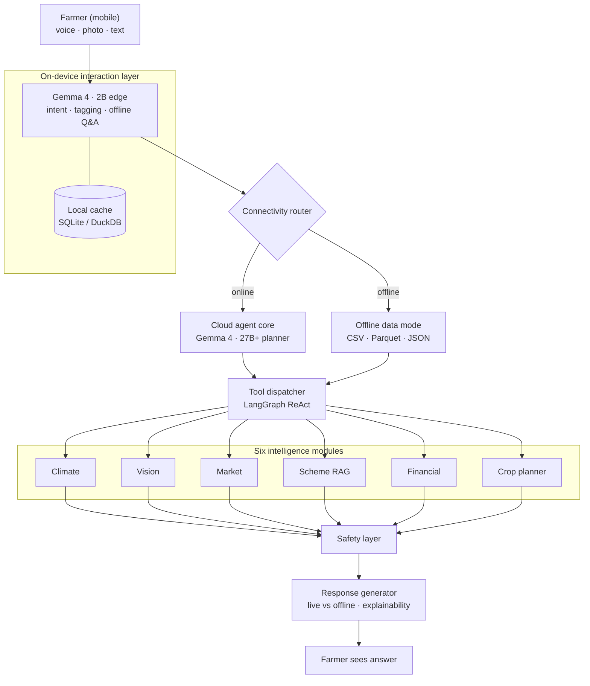

# KrishiSaathi AI — Backend Architecture

> **Hybrid edge + cloud + offline** AI agent for Indian farmers, powered by Google DeepMind **Gemma 4**.

| Piece | Choice |
| :--- | :--- |
| Edge model | Gemma 4 · 2B (quantized, on-device) |
| Cloud planner | Gemma 4 · 27B+ (Vertex AI / cloud) |
| Orchestration | LangGraph ReAct loop |
| API / data | FastAPI · PostgreSQL · Redis · ChromaDB |
| **Architecture diagram** | [Section 2 — System architecture](#2-system-architecture) and Cursor Canvas `krishisaathi-architecture.canvas.tsx` |

---

## Table of contents

- [1. Overview](#1-overview)
- [2. System architecture](#2-system-architecture)
- [3. Layer-by-layer design](#3-layer-by-layer-design)
  - [3.1 Interaction layer (on-device)](#31-interaction-layer-on-device)
  - [3.2 Connectivity router](#32-connectivity-router)
  - [3.3 Cloud agent core](#33-cloud-agent-core)
  - [3.4 Offline data mode](#34-offline-data-mode)
  - [3.5 Agent tool dispatcher (LangGraph ReAct)](#35-agent-tool-dispatcher-langgraph-react)
  - [3.6 Intelligence modules (6 tools)](#36-intelligence-modules-6-tools)
  - [3.7 Safety layer](#37-safety-layer)
  - [3.8 Response generator](#38-response-generator)
- [4. Data models](#4-data-models)
- [5. API contract](#5-api-contract)
- [6. Technology stack](#6-technology-stack)
- [7. Directory structure](#7-directory-structure)
- [8. Key design decisions](#8-key-design-decisions)
- [9. Scalability & deployment](#9-scalability--deployment)

---

## 1. Overview

**KrishiSaathi** (“Farmer’s Companion”) is an autonomous AI agent that helps Indian farmers with:

- Crop disease detection (image analysis)
- Hyperlocal weather risk alerts
- Real-time and predicted market prices
- Government scheme discovery (RAG)
- Personalized financial and crop planning

The system is built around three constraints:

| Constraint | Response |
| :---       | :---     |
| Poor or no connectivity | Hybrid edge–cloud with offline fallback |
| Non-English, low-literacy users | Voice + Hinglish / regional language support |
| Fragmented information | One agentic surface across six intelligence modules |

The AI “brain” uses **Gemma 4** (2B on edge, 27B+ in cloud), orchestrated with a **LangGraph ReAct** loop.

---

## 2. System architecture

### Interactive diagram (Cursor Canvas)

A **live DAG** of this pipeline is implemented as a Cursor Canvas: it calls `computeDAGLayout` from `cursor/canvas` and draws boxes and edges with your IDE theme tokens (no screenshots—stays in sync when you change the graph).

**File:** `canvases/krishisaathi-architecture.canvas.tsx` under your Cursor project folder for this workspace (e.g. `…\.cursor\projects\c-Workspace-Project-Personal-Projects-Hackathon-KrishiSaathi-AI\canvases\` on Windows).

Open it in Cursor and use the **Canvas** view beside the chat or editor while you build the backend.

### Diagram (Mermaid)

Renders on GitHub, GitLab, and many Markdown previews:



---

## 3. Layer-by-layer design

### 3.1 Interaction layer (on-device)

| | |
| :--- | :--- |
| **Purpose** | Zero-internet usability and low-latency first response |
| **Model** | Gemma 4 · 2B (INT4 quantized, mid-range Android) |
| **Output** | Structured `AgentRequest` → connectivity router |

**Responsibilities**

| Sub-component | Details |
| :--- | :--- |
| Voice input | On-device STT; Hindi, Marathi, Telugu, Punjabi, Hinglish |
| Intent classifier | Intents: `weather`, `crop_disease`, `market_price`, `scheme_query`, `financial`, `crop_plan`, `alert`, `general` |
| Image tagging | Lightweight ViT for crop / pest / soil tags before cloud vision |
| Offline Q&A | Simple cached queries without cloud |
| Local cache | SQLite / DuckDB read–write on device |

### 3.2 Connectivity router

**Purpose:** Route to cloud agent vs offline mode.

```text
if network_quality >= THRESHOLD:
    → Cloud agent core
else:
    → Offline data mode
```

- `THRESHOLD` is configurable (default: ~2G, ~50 kbps).
- Every response includes `data_source`: `"live"` \| `"offline"`.

### 3.3 Cloud agent core

| | |
| :--- | :--- |
| **Purpose** | Heavy reasoning, multi-step planning, tool orchestration |
| **Model** | Gemma 4 · 27B+ (Google Cloud / Vertex AI) |
| **Pattern** | ReAct — planner emits JSON tool calls; LangGraph executes |

**Responsibilities**

- Parse `AgentRequest` from the edge layer.
- Produce a structured `Plan` (ordered tool calls).
- Hand off to the tool dispatcher; synthesize tool outputs into a coherent answer.

### 3.4 Offline data mode

**Purpose:** Useful answers with no connectivity.

**Bundled / synced assets**

| File | Format | Sync cadence |
| :--- | :--- | :--- |
| `weather_history.parquet` | Parquet | Weekly |
| `mandi_prices.csv` | CSV | Daily (WiFi) |
| `scheme_index.json` | JSON | Monthly |
| `crop_calendar.json` | JSON | Seasonal |

Offline answers include a clear disclaimer, e.g.  
`Using cached offline data. Last updated: <timestamp>`.

### 3.5 Agent tool dispatcher (LangGraph ReAct)

**Purpose:** Run planner tool calls in a bounded loop.

```text
1. Receive plan from planner LLM
2. For each step:
     a. Dispatch to the right intelligence module
     b. Collect ToolResult
     c. Inject result into LLM context
3. If more tool calls requested → repeat
4. On final answer → safety layer
```

| Parameter | Value |
| :--- | :--- |
| Max iterations | 6 (configurable, avoids runaway loops) |
| Timeout per tool | 8 seconds |
| Trace | Each call logged as `ToolTrace` for explainability |

### 3.6 Intelligence modules (6 tools)

| Module | Role |
| :--- | :--- |
| Climate engine | Weather risk, irrigation hints |
| Vision engine | Crop disease from images |
| Market engine | Prices + short-horizon forecast |
| Scheme navigator | Govt schemes via RAG |
| Financial advisor | Loans, ROI, insurance (code-backed numbers) |
| Crop planner | Season / soil / market–aware recommendations |

#### Climate engine

- **Input:** GPS, crop type  
- **Sources:** OpenWeatherMap, IMD  
- **Output:** 7-day outlook, rain risk, irrigation suggestion  
- **Offline:** Historical average for month / region  

#### Vision engine (crop disease)

- **Input:** JPEG / PNG  
- **Model:** Fine-tuned Gemma 4 vision or Google Vision API  
- **Output:** Disease label, confidence, treatment hints  
- **Offline:** On-device tag heuristics  

#### Market engine

- **Input:** Crop, district / mandi  
- **Sources:** Agmarknet, eNAM  
- **Output:** Spot price, ~7-day forecast (ARIMA / Prophet), buy/sell hint  
- **Offline:** Last cached price + trend label  

#### Scheme navigator (RAG)

- **Input:** Farmer profile + intent  
- **Store:** ChromaDB / Pinecone over scheme documents  
- **Flow:** Top-K retrieval → rerank → LLM answer  
- **Offline:** Keyword search on `scheme_index.json`  

#### Financial advisor

- **Input:** Digital twin (land, loan, crop plan)  
- **Output:** Eligibility, ROI band, insurance pointers  
- **Logic:** Rules + LLM narrative; **all numbers from code**, not free-generated.

#### Crop planner

- **Input:** Soil, location, season, water, market trend  
- **Output:** Top 3 crops + rationale  
- **Logic:** Rule-based score + LLM explanation  

### 3.7 Safety layer

**Purpose:** Block harmful, hallucinated, or legally risky content before the user sees it.

| Check | On failure |
| :--- | :--- |
| Number without source | Strip or tag `[unverified]` |
| Medical / veterinary claim without citation | Block; point to local expert |
| Sensitive political content | Neutralize / redirect |
| Confidence below threshold | Prefix uncertainty + expert verification |
| Toxic language | Filter / regenerate |

Runs **after** tool synthesis, **before** the response generator.

### 3.8 Response generator

**Purpose:** Farmer-facing formatting and metadata.

**By query type**

| Query type | Format |
| :--- | :--- |
| Disease | Annotation + steps |
| Weather | Summary card + simple indicators |
| Market | Table + trend payload for charts |
| Scheme | Name, eligibility, how to apply |
| Financial | Table + short narrative |
| Crop plan | Ranked list + reasons |

**Always present**

- `data_source`: `"live"` \| `"offline"`
- `confidence_level`: `high` \| `medium` \| `low`
- `tool_trace`: tools invoked (explainability UI)
- `language`: detected + response locale

---

## 4. Data models

### 4.1 Farmer digital twin

Stored on-device (SQLite); synced to cloud when online.

```json
{
  "farmer_id": "uuid",
  "name": "Ramesh Kumar",
  "location": {
    "state": "Punjab",
    "district": "Ludhiana",
    "village": "Raikot",
    "lat": 30.65,
    "lng": 75.95
  },
  "land": {
    "total_acres": 4.5,
    "soil_type": "loamy",
    "irrigation": "tube_well"
  },
  "current_crops": ["wheat", "mustard"],
  "financial": {
    "kcc_loan_amount": 75000,
    "kcc_bank": "SBI",
    "pm_fasal_bima": true
  },
  "risk_profile": "moderate",
  "preferred_language": "hi",
  "interaction_history": []
}
```

### 4.2 Local cache schema

```sql
CREATE TABLE weather_cache (
    location_key TEXT,
    fetched_at   INTEGER,
    expires_at   INTEGER,
    payload      TEXT
);

CREATE TABLE price_cache (
    crop         TEXT,
    mandi        TEXT,
    fetched_at   INTEGER,
    price_inr    REAL,
    unit         TEXT
);

CREATE TABLE query_history (
    id           INTEGER PRIMARY KEY AUTOINCREMENT,
    query_text   TEXT,
    intent       TEXT,
    response     TEXT,
    timestamp    INTEGER,
    data_source  TEXT
);
```

---

## 5. API contract

REST + JSON internally; the app uses one **gateway**.

### Endpoints

| Method | Path | Description |
| :--- | :--- | :--- |
| `POST` | `/api/v1/query` | Main agent query |
| `GET` | `/api/v1/farmer/{farmer_id}/twin` | Read digital twin |
| `PUT` | `/api/v1/farmer/{farmer_id}/twin` | Update twin (partial OK) |
| `GET` | `/api/v1/health` | Health (used by device router) |

### `POST /api/v1/query`

**Request**

```json
{
  "farmer_id": "uuid",
  "query": {
    "text": "मेरी गेहूं की फसल पीली पड़ रही है",
    "voice_b64": null,
    "image_b64": "<base64>",
    "language": "hi"
  },
  "context": {
    "location": { "lat": 30.65, "lng": 75.95 },
    "connectivity": "online",
    "device_intent": "crop_disease"
  }
}
```

**Response**

```json
{
  "response_id": "uuid",
  "text": "आपकी गेहूं में पीला रतुआ (Yellow Rust) रोग के लक्षण हैं...",
  "structured": {
    "disease": "Yellow Rust",
    "confidence": 0.87,
    "treatment": ["Propiconazole spray", "Remove infected leaves"],
    "urgency": "high"
  },
  "data_source": "live",
  "confidence_level": "high",
  "tool_trace": ["vision_engine", "climate_engine"],
  "language": "hi",
  "timestamp": "2026-04-18T10:30:00Z"
}
```

---

## 6. Technology stack

| Layer | Technology |
| :--- | :--- |
| Edge AI | Gemma 4 · 2B (GGUF / ONNX, quantized) |
| Cloud planner | Gemma 4 · 27B+ (Vertex AI) |
| Agent | LangGraph (Python) |
| API | FastAPI (Python 3.11+) |
| Vector DB (RAG) | ChromaDB (self-hosted) |
| On-device DB | SQLite, DuckDB |
| Cloud DB | PostgreSQL (twin, logs) |
| Cache | Redis |
| Vision | Google Vision API + custom fine-tune |
| Weather | OpenWeatherMap, IMD |
| Markets | Agmarknet, eNAM |
| Forecasting | Prophet / ARIMA |
| Cloud | GCP, GKE |
| Containers | Docker, Kubernetes |
| Async jobs | Google Pub/Sub |
| Observability | Cloud Monitoring + dashboards |

---

## 7. Directory structure

```text
krishisaathi-ai/
├── api/                          # FastAPI gateway
│   ├── main.py
│   ├── routes/
│   │   ├── query.py
│   │   └── farmer.py
│   └── middleware/
│       ├── auth.py
│       └── rate_limit.py
├── agent/                        # LangGraph core
│   ├── orchestrator.py
│   ├── planner.py
│   ├── dispatcher.py
│   └── react_loop.py
├── modules/
│   ├── climate/
│   │   ├── engine.py
│   │   └── offline_fallback.py
│   ├── vision/
│   │   ├── engine.py
│   │   └── tagger.py
│   ├── market/
│   │   ├── engine.py
│   │   ├── forecaster.py
│   │   └── offline_fallback.py
│   ├── scheme/
│   │   ├── navigator.py
│   │   ├── vector_store.py
│   │   └── offline_search.py
│   ├── financial/
│   │   └── advisor.py
│   └── crop_planner/
│       └── planner.py
├── safety/
│   └── layer.py
├── response/
│   └── generator.py
├── models/
│   ├── farmer.py
│   ├── request.py
│   └── response.py
├── db/
│   ├── postgres.py
│   └── migrations/
├── cache/
│   └── redis_client.py
├── offline/
│   ├── data/
│   │   ├── mandi_prices.csv
│   │   ├── weather_history.parquet
│   │   ├── scheme_index.json
│   │   └── crop_calendar.json
│   └── sync.py
├── config/
│   └── settings.py
├── tests/
│   ├── unit/
│   └── integration/
├── docker-compose.yml
├── Dockerfile
├── requirements.txt
├── ARCHITECTURE.md
└── README.md
```

---

## 8. Key design decisions

| Question | Answer |
| :--- | :--- |
| **Why LangGraph?** | First-class graph + state for ReAct, conditional edges (online/offline), streaming — less custom loop code. |
| **Why 2B + 27B?** | 2B for on-device latency and offline basics; 27B for multi-step cloud reasoning; balances cost and quality. |
| **Why safety after tools?** | Tools return numbers (prices, dosages) the LLM might misquote; checks run closest to the final user-facing text. |
| **Why code for finance?** | LLMs are weak at arithmetic; Python computes eligibility / ROI / insurance; the model only narrates. |
| **Why local-first twin?** | Weeks offline is normal; personalization must work without sync; cloud updates when possible. |

---

## 9. Scalability & deployment

| Topic | Approach |
| :--- | :--- |
| API | Stateless `POST /api/v1/query`; horizontal scale behind a load balancer |
| Long tools | Vision / forecast via Pub/Sub; return `job_id`, poll or push |
| Rate limits | Per `farmer_id` (e.g. ~10 req/min) |
| Cache | Redis for weather/price (~1h TTL) |
| Models | Version in `config/settings.py`, override via env for A/B |
| Cold start | Warm pool for agent core; scale to ~5 replicas under load |

---

| | |
| :--- | :--- |
| **Document version** | 0.2 |
| **Last updated** | April 2026 |
| **Note** | Source of truth for backend architecture; update before structural changes. |
