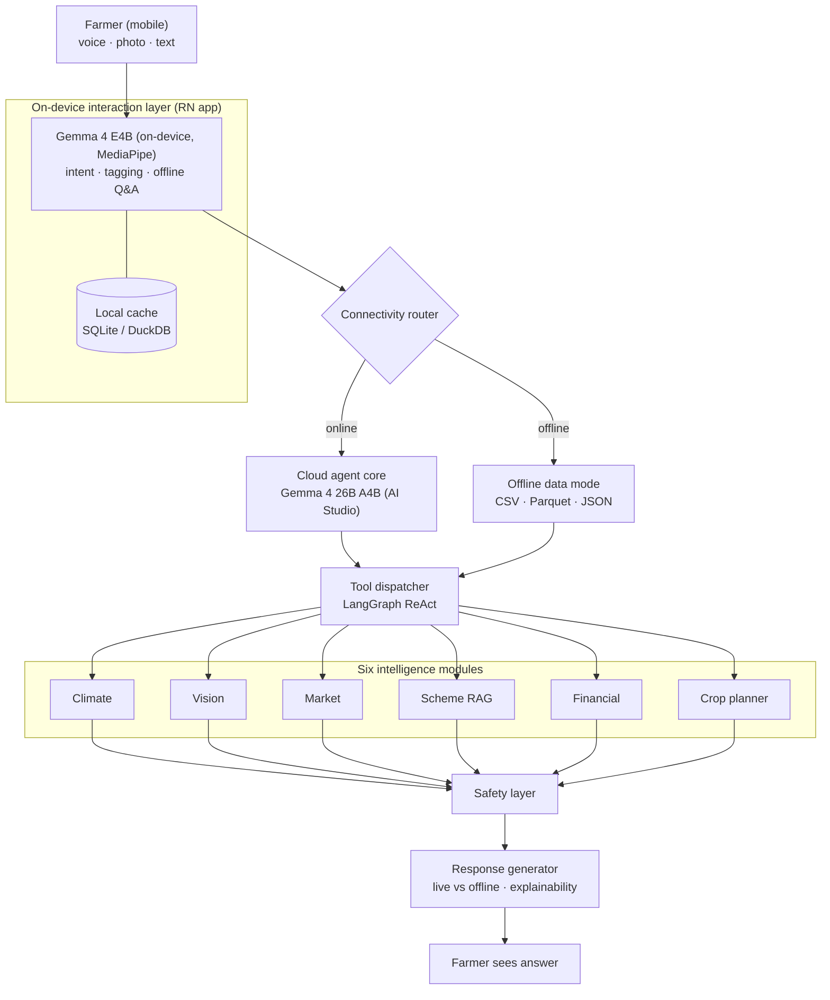

# KrishiSaathi AI — Backend Architecture

> **Hybrid edge + cloud + offline** AI agent for Indian farmers, powered by Google DeepMind **Gemma 4**.

| Piece | Choice |
| :--- | :--- |
| On-device | **Gemma 4 E4B** (fallback **E2B**) via **MediaPipe LLM Inference** in the RN companion app — free, offline-friendly |
| Cloud primary | **Google AI Studio** (Gemini API) with `gemma-4-26b-a4b-it` — free tier, no paid Vertex required |
| Cloud escalation | `gemma-4-31b-it` via **Google AI Studio** for low-confidence queries |
| Orchestration | **LangGraph**-style loop: route → plan → tools → synthesize → safety → respond |
| API / data | **FastAPI** · **SQLite** (twin, rate limits, logs) · **ChromaDB** (scheme RAG) |
| Weather (live) | **Open-Meteo** — no API key |
| **Frontend** | Separate RN app; this repo is **backend-only** — see [`docs/api_contract.md`](docs/api_contract.md) and [`docs/frontend_handoff.md`](docs/frontend_handoff.md) |
| **Architecture diagram** | [Section 2 — System architecture](#2-system-architecture) and Cursor Canvas `krishisaathi-architecture.canvas.tsx` (optional) |

---

## Table of contents

- [1. Overview](#1-overview)
- [2. System architecture](#2-system-architecture)
- [3. Layer-by-layer design](#3-layer-by-layer-design)
  - [3.1 Interaction layer (on-device)](#31-interaction-layer-on-device)
  - [3.2 Connectivity router](#32-connectivity-router)
  - [3.3 Cloud agent core](#33-cloud-agent-core)
  - [3.4 Offline data mode](#34-offline-data-mode)
  - [3.5 Agent tool dispatcher (LangGraph ReAct)](#35-agent-tool-dispatcher-langgraph-react)
  - [3.6 Intelligence modules (6 tools)](#36-intelligence-modules-6-tools)
  - [3.7 Safety layer](#37-safety-layer)
  - [3.8 Response generator](#38-response-generator)
- [4. Data models](#4-data-models)
- [5. API contract](#5-api-contract)
- [6. Technology stack](#6-technology-stack)
- [7. Directory structure](#7-directory-structure)
- [8. Key design decisions](#8-key-design-decisions)
- [9. Scalability & deployment](#9-scalability--deployment)

---

## 1. Overview

**KrishiSaathi** (“Farmer’s Companion”) is an autonomous AI agent that helps Indian farmers with:

- Crop disease detection (image analysis)
- Hyperlocal weather risk alerts
- Real-time and predicted market prices
- Government scheme discovery (RAG)
- Personalized financial and crop planning

The system is built around three constraints:

| Constraint | Response |
| :---       | :---     |
| Poor or no connectivity | Hybrid edge–cloud with offline fallback |
| Non-English, low-literacy users | Voice + Hinglish / regional language support |
| Fragmented information | One agentic surface across six intelligence modules |

The AI "brain" uses **Gemma 4** end-to-end: **Gemma 4 E4B** (fallback **E2B**) on-device via **MediaPipe LLM Inference** in the RN companion app, and `gemma-4-26b-a4b-it` on **Google AI Studio** for cloud reasoning (escalating to `gemma-4-31b-it` when confidence is low), orchestrated with a **LangGraph**-style tool loop (see `agent/react_loop.py`).

---

## 2. System architecture

### Interactive diagram (Cursor Canvas)

A **live DAG** of this pipeline is implemented as a Cursor Canvas: it calls `computeDAGLayout` from `cursor/canvas` and draws boxes and edges with your IDE theme tokens (no screenshots—stays in sync when you change the graph).

**File:** `canvases/krishisaathi-architecture.canvas.tsx` under your Cursor project folder for this workspace (e.g. `…\.cursor\projects\c-Workspace-Project-Personal-Projects-Hackathon-KrishiSaathi-AI\canvases\` on Windows).

Open it in Cursor and use the **Canvas** view beside the chat or editor while you build the backend.

### Diagram (Mermaid)

Renders on GitHub, GitLab, and many Markdown previews:



---

## 3. Layer-by-layer design

### 3.1 Interaction layer (on-device)

On-device: **Gemma 4 E4B** (fallback **E2B**) via **MediaPipe LLM Inference** in the RN companion app.

| | |
| :--- | :--- |
| **Purpose** | Zero-internet usability and low-latency first response |
| **Model** | `gemma-4-e4b-it` (primary); `gemma-4-e2b-it` fallback on <4 GB RAM devices |
| **Runtime** | MediaPipe LLM Inference (Android); weights downloaded from Google AI Edge Gallery on first launch |
| **Output** | Structured `AgentRequest` → connectivity router |

**Responsibilities**

| Sub-component | Details |
| :--- | :--- |
| Voice input | On-device STT; Hindi, Marathi, Telugu, Punjabi, Hinglish |
| Intent classifier | Intents: `weather`, `crop_disease`, `market_price`, `scheme_query`, `financial`, `crop_plan`, `alert`, `general` |
| Image tagging | Lightweight ViT for crop / pest / soil tags before cloud vision |
| Offline Q&A | Simple cached queries without cloud |
| Local cache | SQLite / DuckDB read–write on device |

### 3.2 Connectivity router

**Purpose:** Route to cloud agent vs offline mode.

```text
if network_quality >= THRESHOLD:
    → Cloud agent core
else:
    → Offline data mode
```

- `THRESHOLD` is configurable (default: ~2G, ~50 kbps).
- Every response includes `data_source`: `"live"` \| `"offline"`.

### 3.3 Cloud agent core

Primary model: `gemma-4-26b-a4b-it`. Escalates to `gemma-4-31b-it` when safety-layer confidence is below threshold.

| | |
| :--- | :--- |
| **Purpose** | Heavy reasoning, multi-step planning, tool orchestration |
| **Primary model** | `gemma-4-26b-a4b-it` via **Google AI Studio** (`AI_STUDIO_MODEL` in `config/settings.py`) — no Vertex AI required for the hackathon build |
| **Escalation model** | `gemma-4-31b-it` via **Google AI Studio** (triggered by safety layer on low confidence) |
| **Pattern** | Planner emits JSON tool calls; `langgraph` graph executes route → plan → tools → synthesize → safety → respond |

**Responsibilities**

- Parse `AgentRequest` from the edge layer.
- Produce a structured `Plan` (ordered tool calls).
- Hand off to the tool dispatcher; synthesize tool outputs into a coherent answer.

### 3.4 Offline data mode

**Purpose:** Useful answers with no connectivity.

**Bundled / synced assets**

| File | Format | Sync cadence |
| :--- | :--- | :--- |
| `weather_history.parquet` | Parquet | Weekly |
| `mandi_prices.csv` | CSV | Daily (WiFi) |
| `scheme_index.json` | JSON | Monthly |
| `crop_calendar.json` | JSON | Seasonal |

Offline answers include a clear disclaimer, e.g.  
`Using cached offline data. Last updated: <timestamp>`.

### 3.5 Agent tool dispatcher (LangGraph ReAct)

**Purpose:** Run planner tool calls in a bounded loop.

```text
1. Receive plan from planner LLM
2. For each step:
     a. Dispatch to the right intelligence module
     b. Collect ToolResult
     c. Inject result into LLM context
3. If more tool calls requested → repeat
4. On final answer → safety layer
```

| Parameter | Value |
| :--- | :--- |
| Max iterations | 6 (configurable, avoids runaway loops) |
| Timeout per tool | Per-kind caps via env (vision 60s, LLM tools 30s, climate 12s, local I/O 5s; see `config/settings.py`) |
| Trace | Each call logged as `ToolTrace` for explainability |

### 3.6 Intelligence modules (6 tools)

| Module | Role |
| :--- | :--- |
| Climate engine | Weather risk, irrigation hints |
| Vision engine | Crop disease from images |
| Market engine | Prices + short-horizon forecast |
| Scheme navigator | Govt schemes via RAG |
| Financial advisor | Loans, ROI, insurance (code-backed numbers) |
| Crop planner | Season / soil / market–aware recommendations |

#### Climate engine

- **Input:** GPS, crop type  
- **Sources:** **Open-Meteo** (free, no key); IMD can be added later  
- **Output:** 7-day outlook, rain risk, irrigation suggestion  
- **Offline:** Historical average for month / region (`offline/data/weather_history.parquet`)  

#### Vision engine (crop disease)

- **Input:** JPEG / PNG  
- **Model:** Fine-tuned Gemma 4 vision or Google Vision API  
- **Output:** Disease label, confidence, treatment hints  
- **Offline:** On-device tag heuristics  

#### Market engine

- **Input:** Crop, district / mandi  
- **Sources:** Agmarknet, eNAM  
- **Output:** Spot price, ~7-day forecast (ARIMA / Prophet), buy/sell hint  
- **Offline:** Last cached price + trend label  

#### Scheme navigator (RAG)

- **Input:** Farmer profile + intent  
- **Store:** ChromaDB / Pinecone over scheme documents  
- **Flow:** Top-K retrieval → rerank → LLM answer  
- **Offline:** Keyword search on `scheme_index.json`  

#### Financial advisor

- **Input:** Digital twin (land, loan, crop plan)  
- **Output:** Eligibility, ROI band, insurance pointers  
- **Logic:** Rules + LLM narrative; **all numbers from code**, not free-generated.

#### Crop planner

- **Input:** Soil, location, season, water, market trend  
- **Output:** Top 3 crops + rationale  
- **Logic:** Rule-based score + LLM explanation  

### 3.7 Safety layer

**Purpose:** Block harmful, hallucinated, or legally risky content before the user sees it.

| Check | On failure |
| :--- | :--- |
| Number without source | Strip or tag `[unverified]` |
| Medical / veterinary claim without citation | Block; point to local expert |
| Sensitive political content | Neutralize / redirect |
| Confidence below threshold | Prefix uncertainty + expert verification |
| Toxic language | Filter / regenerate |

Runs **after** tool synthesis, **before** the response generator.

When a synthesized answer falls below the confidence threshold (default `0.70`), the safety layer **escalates** from `gemma-4-26b-a4b-it` to `gemma-4-31b-it` and re-synthesizes before the response leaves the server. The escalation is recorded in `tool_trace` and surfaced via `model_used` in the response payload.

### 3.8 Response generator

**Purpose:** Farmer-facing formatting and metadata.

**By query type**

| Query type | Format |
| :--- | :--- |
| Disease | Annotation + steps |
| Weather | Summary card + simple indicators |
| Market | Table + trend payload for charts |
| Scheme | Name, eligibility, how to apply |
| Financial | Table + short narrative |
| Crop plan | Ranked list + reasons |

**Always present**

- `data_source`: `"live"` \| `"offline"`
- `confidence_level`: `high` \| `medium` \| `low`
- `tool_trace`: tools invoked (explainability UI)
- `language`: detected + response locale

---

## 4. Data models

### 4.1 Farmer digital twin

Stored on-device (SQLite); synced to cloud when online.

```json
{
  "farmer_id": "uuid",
  "name": "Ramesh Kumar",
  "location": {
    "state": "Punjab",
    "district": "Ludhiana",
    "village": "Raikot",
    "lat": 30.65,
    "lng": 75.95
  },
  "land": {
    "total_acres": 4.5,
    "soil_type": "loamy"
  },
  "current_crops": ["wheat", "mustard"],
  "preferred_language": "hi"
}
```

### 4.2 Local cache schema

```sql
CREATE TABLE weather_cache (
    location_key TEXT,
    fetched_at   INTEGER,
    expires_at   INTEGER,
    payload      TEXT
);

CREATE TABLE price_cache (
    crop         TEXT,
    mandi        TEXT,
    fetched_at   INTEGER,
    price_inr    REAL,
    unit         TEXT
);

CREATE TABLE query_history (
    id           INTEGER PRIMARY KEY AUTOINCREMENT,
    query_text   TEXT,
    intent       TEXT,
    response     TEXT,
    timestamp    INTEGER,
    data_source  TEXT
);
```

---

## 5. API contract

REST + JSON; **frontend is separate** (RN app) — integrate via OpenAPI (`/docs`) or [`docs/api_contract.md`](docs/api_contract.md) (v0.2). RN integration notes: [`docs/frontend_handoff.md`](docs/frontend_handoff.md).

### Endpoints

| Method | Path | Description |
| :--- | :--- | :--- |
| `GET` | `/api/v1/health` | Liveness + Gemma 4 reachability |
| `POST` | `/api/v1/query` | Main agent query (references uploaded images via `image_ref`) |
| `POST` | `/api/v1/query/image` | Multipart image upload (JPEG/PNG ≤ 5 MB) → returns `image_ref` |
| `GET` | `/api/v1/sync/bundle` | District-scoped offline bundle (gzipped JSON, ETag-style `bundle_version`) |
| `GET` | `/api/v1/farmer/{farmer_id}/twin` | Read digital twin |
| `PUT` | `/api/v1/farmer/{farmer_id}/twin` | Update twin (partial OK) |

All non-2xx responses use the unified error envelope defined in [`docs/api_contract.md`](docs/api_contract.md) §6, including a `fallback_hint` (`USE_ONDEVICE` / `RETRY_ONLINE_LATER` / `null`) that the RN app uses to choose between on-device re-run and a retry CTA.

### `POST /api/v1/query`

**Request**

```json
{
  "farmer_id": "uuid",
  "query": {
    "text": "मेरी गेहूं की फसल पीली पड़ रही है",
    "image_ref": "img_7a3f...",
    "language": "hi"
  },
  "context": {
    "location": { "lat": 30.65, "lng": 75.95, "district": "Ludhiana", "state": "Punjab" },
    "connectivity": "online",
    "device_intent": "crop_disease",
    "device_capabilities": { "ondevice_model": "gemma-4-e4b-it" }
  }
}
```

**Response**

```json
{
  "response_id": "uuid",
  "text": "आपकी गेहूं में पीला रतुआ (Yellow Rust) रोग के लक्षण हैं...",
  "structured": {
    "kind": "disease",
    "data": {
      "disease": "Yellow Rust",
      "treatment": ["Propiconazole spray", "Remove infected leaves"],
      "urgency": "high"
    }
  },
  "data_source": "live",
  "confidence_level": "high",
  "confidence_score": 0.87,
  "model_used": "gemma-4-26b-a4b-it",
  "tool_trace": ["vision", "climate"],
  "safety_flags": [],
  "fallback_hint": null,
  "language": "hi",
  "timestamp": "2026-04-20T12:00:00Z"
}
```

---

## 6. Technology stack

| Layer | Technology |
| :--- | :--- |
| On-device LLM (RN app) | **Gemma 4 E4B** / **E2B** via MediaPipe LLM Inference |
| Cloud LLM (primary) | Google AI Studio — `gemma-4-26b-a4b-it` (`AI_STUDIO_MODEL` env) |
| Cloud LLM (escalation) | Google AI Studio — `gemma-4-31b-it` (`AI_STUDIO_ESCALATION_MODEL` env) |
| Agent | LangGraph (Python) |
| API | FastAPI (Python 3.11+) |
| Vector DB (RAG) | ChromaDB (embedded, on-disk) |
| App DB | SQLite (farmer twin, caches, rate limits, query log) |
| Analytics / offline SQL | DuckDB (read Parquet) |
| Vision | Multimodal prompt via Google AI Studio (`gemma-4-26b-a4b-it`) |
| Weather | Open-Meteo (free) |
| Markets | Bundled `mandi_prices.csv` (+ optional future Agmarknet) |
| Containers | Docker / Docker Compose (optional) |

---

## 7. Directory structure

```text
krishisaathi-ai/
├── api/
│   ├── main.py
│   ├── routes/
│   │   ├── query.py          # POST /query, GET /query/stream (SSE)
│   │   ├── farmer.py
│   │   └── health.py
│   └── middleware/
│       └── rate_limit.py
├── agent/
│   ├── gemma_client.py       # Google AI Studio (Gemma 4 primary + escalation)
│   ├── connectivity_router.py
│   ├── orchestrator.py
│   ├── planner.py
│   ├── dispatcher.py
│   └── react_loop.py
├── modules/
│   ├── climate/
│   ├── vision/
│   ├── market/
│   ├── scheme/
│   ├── financial/
│   └── crop_planner/
├── safety/
├── response/
├── models/
├── db/
│   └── sqlite_client.py
├── offline/
│   ├── bootstrap_data.py
│   ├── sync.py
│   └── data/                 # generated JSON / CSV / Parquet
├── docs/
│   ├── api_contract.md
│   └── postman_collection.json
├── tests/
├── docker-compose.yml
├── Dockerfile
├── requirements.txt
├── ARCHITECTURE.md
└── README.md
```

---

## 8. Key design decisions

| Question | Answer |
| :--- | :--- |
| **Why LangGraph?** | First-class graph + state for ReAct, conditional edges (online/offline), streaming — less custom loop code. |
| **Why hybrid on-device + AI Studio?** | On-device `gemma-4-e4b-it` via MediaPipe gives zero-network latency and airplane-mode support; `gemma-4-26b-a4b-it` on AI Studio (with `gemma-4-31b-it` escalation) gives stronger reasoning on a free tier — all Gemma 4, no paid Vertex. |
| **Why safety after tools?** | Tools return numbers (prices, dosages) the LLM might misquote; checks run closest to the final user-facing text. |
| **Why code for finance?** | LLMs are weak at arithmetic; Python computes eligibility / ROI / insurance; the model only narrates. |
| **Why local-first twin?** | Weeks offline is normal; personalization must work without sync; cloud updates when possible. |

---

## 9. Scalability & deployment

| Topic | Approach |
| :--- | :--- |
| API | Stateless `POST /api/v1/query`; SQLite-backed rate limit per `farmer_id` (~10 req/min) |
| Long tools | In-process per-tool timeouts (`VISION_TIMEOUT_SECONDS`, `LLM_TOOL_TIMEOUT_SECONDS`, `CLIMATE_TIMEOUT_SECONDS`, `IO_TOOL_TIMEOUT_SECONDS`; `TOOL_TIMEOUT_SECONDS` = fallback for unknown tools); extend with job queue later |
| Data | SQLite file + Chroma directory — mount a volume in Docker (`docker-compose.yml`) |
| Models | `config/settings.py` + env (`AI_STUDIO_MODEL`, `AI_STUDIO_ESCALATION_MODEL`) |
| Prod (future) | Add PostgreSQL/Redis only if traffic demands; hackathon build stays minimal |

---

| | |
| :--- | :--- |
| **Document version** | 0.3 |
| **Last updated** | April 2026 |
| **Note** | Hackathon-oriented backend: free-tier models & data, SQLite, no Gradio UI in-repo. |
